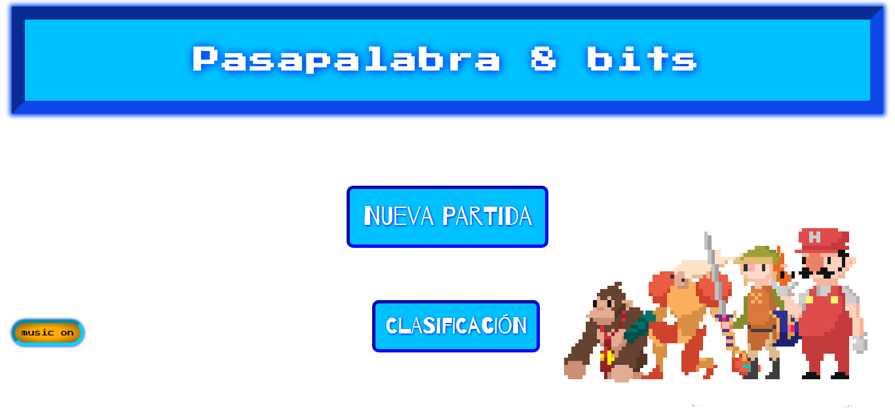
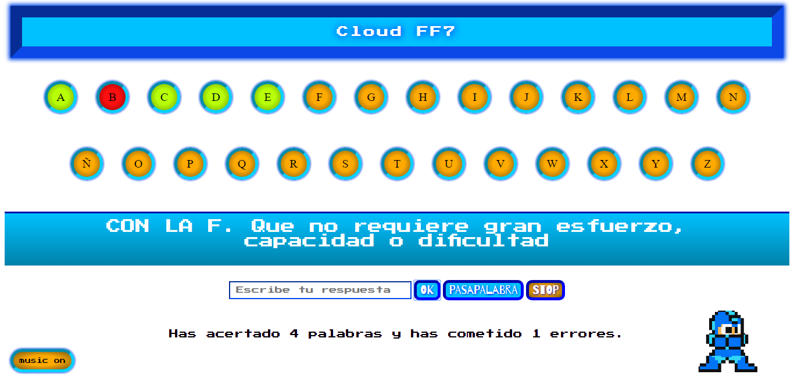

# Pasapalabra 8 bits

This repository contains my first web project before starting the **Skylab Coders Academy Bootcamp**. I used `HTML`, `CSS` and `JavaScript` to write the code.

Adaptation of [**Pasapalabra's game**(Click me to play!)](https://misan7.github.io/pasapalabra_8bits/) from the _Tv show_ in an imitation of 8 pixels environment.

It has a **toggle ON/OFF** music button and when you click on __New Game__ you have to write your name. There is an option to see the **Highscores** but is just an static page. There are _Megaman_ and _Mushrooms_ from _Mario_ animations when you answer the questions.

